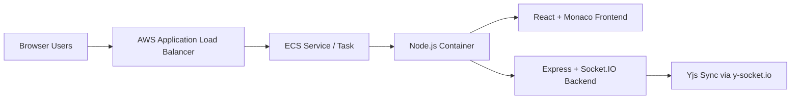

# Docker Code Editor

A collaborative browser-based code editor built with React, Monaco Editor, Yjs CRDTs, Socket.IO, and Express. The app is containerized with Docker and deployed on AWS using ECR + ECS behind an ALB.

## Live Deployment

- URL: http://Docker-aws-Codeeditor-ALB-246380298.ap-south-1.elb.amazonaws.com

## Key Highlights

- Real-time collaborative editing with conflict-free sync (Yjs)
- Monaco-powered code editing experience
- Presence awareness (online users list)
- Single-container deployment (frontend build served by backend)
- Production deployment on AWS ECS via ECR image

## Architecture



## Tech Stack

| Layer | Technology |
|---|---|
| Frontend | React 19, Vite, Monaco Editor, Tailwind CSS |
| Collaboration | Yjs, y-monaco, y-socket.io, Socket.IO |
| Backend | Node.js, Express 5 |
| Containerization | Docker |
| Cloud | AWS ECR, AWS ECS, AWS ALB |

## Project Structure

```text
CodeEditor/
|- dockerfile
|- backend/
|  |- package.json
|  `- server.js
`- frontend/
   |- package.json
   |- vite.config.js
   `- src/
      |- main.jsx
      `- app/
         |- App.jsx
         `- App.css
```

## Backend API

Base URL (Production): `http://Docker-aws-Codeeditor-ALB-246380298.ap-south-1.elb.amazonaws.com`

### Health Check

- Method: `GET`
- Endpoint: `/health`
- Description: Returns service health status.

Example response:

```json
{
  "message": "ok",
  "success": true
}
```

### Realtime Collaboration Endpoint

- Protocol: WebSocket (Socket.IO)
- Path: `/` (default Socket.IO path)
- Provider: `YSocketIO` using room/document id `monaco`
- CORS: Enabled for all origins in current backend config

## Frontend Behavior / Contract

- Join screen accepts a username.
- Username is stored in query params: `?username=<name>`.
- After join, frontend connects to Socket.IO provider and syncs Monaco text state through Yjs.
- Active users list is driven by awareness states.

## Setup and Run

## Prerequisites

- Node.js 20+
- npm 9+
- Docker (recommended for full-stack run)

## Option 1: Run with Docker (recommended)

```bash
docker build -f dockerfile -t docker-code-editor .
docker run --name docker-code-editor -p 3000:3000 docker-code-editor
```

Open: `http://localhost:3000`

## Option 2: Run locally with Node.js

Because the frontend currently uses same-origin Socket.IO (`/`), the reliable local workflow is to build frontend and serve it from backend `public/`.

1. Install backend dependencies

```bash
cd backend
npm install
```

2. Build frontend

```bash
cd ../frontend
npm install
npm run build
```

3. Copy built frontend to backend public folder

```bash
# from repository root
# Windows PowerShell example
Remove-Item -Recurse -Force .\backend\public\* -ErrorAction SilentlyContinue
Copy-Item -Recurse -Force .\frontend\dist\* .\backend\public\
```

4. Start backend

```bash
cd backend
npm run start
```

Open: `http://localhost:3000`

## NPM Scripts

### Backend (`backend/package.json`)

- `npm run dev` -> Start with nodemon
- `npm run start` -> Start with node

### Frontend (`frontend/package.json`)

- `npm run dev` -> Start Vite dev server
- `npm run build` -> Build production assets
- `npm run preview` -> Preview production build
- `npm run lint` -> Run ESLint

## AWS Deployment Notes

This project is deployed using:

- Docker image pushed to AWS ECR
- ECS service/tasks running the container
- ALB exposing public HTTP endpoint

High-level flow:

1. Build Docker image
2. Push image to ECR
3. Update ECS service/task definition
4. Access app through ALB DNS

## Future Improvements

- Add authentication and access control
- Add document/room management (dynamic room IDs)
- Persist session metadata and collaboration history
- Add CI/CD workflow for automated ECS deploys
- Add HTTPS (ACM + ALB listener)

## License

This project currently has no explicit license file. Add a `LICENSE` file to define usage terms.
