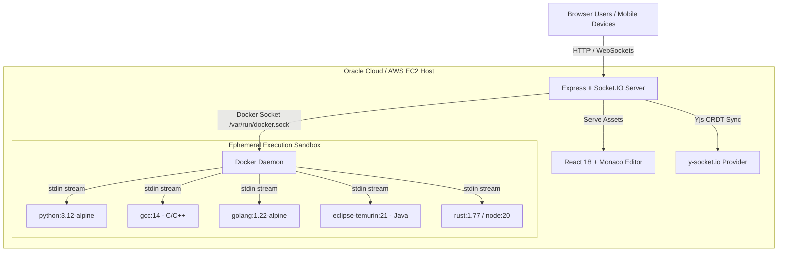

# CodeSync - Real-Time Collaborative Code Editor

A powerful, full-stack, real-time collaborative code editor built with React 18, Monaco Editor, Yjs CRDTs, Socket.IO, and Express. CodeSync supports real-time multi-user editing, intelligent multi-language autocompletion, responsive mobile layout, and a secure **Container-in-Container (Docker-in-Docker)** code execution engine for executing multi-language scripts safely in isolated sandboxes.

## 🌐 Live Deployment

- **Live Production URL (Oracle Cloud)**: [http://92.4.93.193:3000](http://92.4.93.193:3000)
- **AWS Infrastructure**: Production architecture also supports AWS deployment (ECR + ECS behind an ALB).

---

## ⚡ Key Highlights & Features

- **⚡ Real-time Collaborative Editing**: Conflict-free text synchronization using Yjs CRDTs and WebSockets (`y-socket.io`).
- **🛡️ Secure Container-in-Container Execution**: Dynamic execution sandbox spawning ephemeral Docker containers (`node`, `python`, `gcc`, `golang`, `rust`, `java`, etc.) via standard input (`stdin`) streaming to prevent shell mangling.
- **💡 Rich Multi-Language Autocompletion**: Customized Monaco Editor with keyword and snippet autocompletions for Python, C++, C, Java, Go, Rust, C#, PHP, Ruby, SQL, HTML, CSS, and JavaScript/TypeScript.
- **📱 Responsive Mobile-Friendly Interface**: Off-canvas drawer sidebar for mobile devices, touch-friendly navigation toolbar, and interactive resizable output panel with touch drag support.
- **👥 Active Presence & Remote Cursors**: Live list of room participants with custom colored avatars, user tags, and real-time remote selection highlights.
- **🔗 Ephemeral Room Sharing**: Easily copy and share room links (`?room=ID`) for instant team collaboration without registration.

---

## 🏗️ Architecture Diagram



---

## 🛠️ Tech Stack

| Layer | Technology |
|---|---|
| **Frontend** | React 18, Vite, Monaco Editor (`@monaco-editor/react`), Tailwind CSS |
| **Collaboration** | Yjs, `y-monaco`, `y-socket.io`, Socket.IO Client |
| **Backend** | Node.js, Express, Socket.IO Server, Child Process (`spawn`) |
| **Sandboxing** | Docker-in-Docker (DinD), Linux `tmpfs`, STDIN piping |
| **Cloud Hosting** | Oracle Cloud Infrastructure (Always Free VM), AWS ECS / ECR / ALB |

---

## 📁 Project Structure

```text
CodeEditor/
├── dockerfile                  # Multi-stage production Dockerfile
├── docker-compose.yml          # Container configuration
├── backend/
│   ├── package.json
│   ├── server.js               # Express API & Socket.IO initialization
│   └── executor.js             # Docker-in-Docker code execution sandbox
└── frontend/
    ├── package.json
    ├── vite.config.js
    └── src/
        ├── main.jsx
        ├── App.jsx             # Main application & editor state manager
        ├── JoinScreen.jsx      # Room join screen
        ├── Toolbar.jsx         # Responsive top navigation & controls
        ├── Sidebar.jsx         # Responsive off-canvas participant drawer
        ├── OutputPanel.jsx      # Resizable output panel (Touch + Mouse)
        ├── languageProviders.js# Custom multi-language autocompletion logic
        ├── useCollaboration.js # Yjs awareness & socket collaboration hook
        └── constants.js        # Supported languages, themes & default templates
```

---

## 🖥️ Supported Execution Languages

The code sandbox dynamically compiles and executes code for 12+ programming languages:

| Language | Execution Sandbox Image | Compilation / Runner Command |
|---|---|---|
| **JavaScript** | `node:20-alpine` | `node` |
| **TypeScript** | Built-in JS Runtime | Transpiled & Executed |
| **Python** | `python:3.12-alpine` | `python3` |
| **C++** | `gcc:14` | `g++ -o /tmp/out && /tmp/out` |
| **C** | `gcc:14` | `gcc -o /tmp/out && /tmp/out` |
| **Go** | `golang:1.22-alpine` | `go run` |
| **Java** | `eclipse-temurin:21-alpine` | `javac && java` |
| **Rust** | `rust:1.77` | `rustc -o /tmp/out && /tmp/out` |
| **PHP** | `php:8.3-alpine` | `php` |
| **Ruby** | `ruby:3.3-alpine` | `ruby` |
| **Bash** | `alpine` | `sh` |

---

## 🚀 Local Setup & Installation

### Prerequisites
- **Node.js**: 20+
- **Docker Desktop**: Running locally (required for code execution)

### Option 1: Run via Docker (Recommended)
```bash
# Build the production single-container image
docker build -t code-editor .

# Run container with host Docker socket mounted for code execution
docker run -d -p 3000:3000 -v /var/run/docker.sock:/var/run/docker.sock --name code-editor code-editor
```
Open your browser at `http://localhost:3000`.

### Option 2: Run in Development Mode
1. **Start Backend**:
   ```bash
   cd backend
   npm install
   npm run dev
   ```
2. **Start Frontend**:
   ```bash
   cd frontend
   npm install
   npm run dev
   ```

---

## ☁️ Production Deployment

### 1. Oracle Cloud Infrastructure (OCI Always Free)
This project is deployed on an **Oracle Cloud Always Free VM** (Ubuntu 22.04 LTS) with zero monthly cost, utilizing host Docker socket binding for micro-container executions.

**Deployment Steps Summary**:
1. Provision an Always Free VM instance on OCI.
2. Configure **Virtual Swap Memory (2GB)** to ensure smooth multi-threaded frontend compilation.
3. Clone repository and build production Docker image:
   ```bash
   git clone https://github.com/SankeT2705/Docker-Code-Editor.git editor
   cd editor
   docker build -t codesync-app .
   ```
4. Run container with Docker socket mount:
   ```bash
   docker run -d --name codesync -p 3000:3000 -v /var/run/docker.sock:/var/run/docker.sock --restart always codesync-app
   ```
5. Configure server firewall and OCI Ingress Rules for TCP port `3000`.

### 2. AWS Infrastructure Notes
The codebase is also fully compatible with AWS Cloud deployment:
- **AWS ECR**: Docker image repository storage.
- **AWS ECS (EC2 / Fargate)**: Container orchestration service.
- **AWS ALB (Application Load Balancer)**: Public HTTP/WebSocket routing.

---

## 📄 License

This project is open-source and available under the MIT License.
